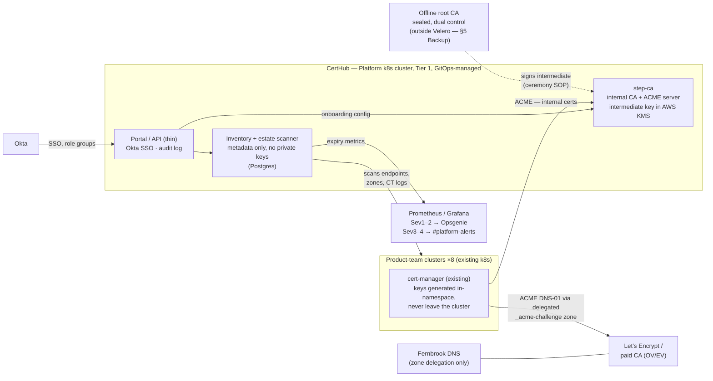

# FSD-FRM-02 — Gate 2 Solution Design: CertHub

**Fernbrook Software — internal.** Confluence `PLAT` → Solution Development. Intake ticket **PLAT-341** (front-door board: Gate 2). Template: FSD-FRM-02 (FitSD v0.3, adopted unmodified per Adoption Pack §3).

## Header

| Field | Entry |
| --- | --- |
| **Solution title** | CertHub — certificate management service |
| **Status** | Approved — with conditions (§8) |
| **Solution Owner** | Priya Chandra |
| **Contributors** | **Elena Vasquez (lead architect — led this design; Consulted SME per Adoption Pack §2)**; Priya Chandra (PoC results, build estimates, migration plan); Owen Gallagher (support model, §4–§5); Rafi Osman (service-desk impact, triage categories); Sam Reyes (requirements workshop with the two pilot teams). *The template names no design-lead role; recorded under Contributors as a local convention.* |
| **Linked Gate 1 (FSD-FRM-01)** | S2-FRM-01 (this space) — approved 2026-08-19, PoC-first with five conditions; PoC concluded at its §7 |
| **Date** | 2026-09-04 |

## 1. Carry-forward from Gate 1

| Field | Entry |
| --- | --- |
| **Outcome / requirement** | Every certificate in the Fernbrook estate known, owned, and either auto-renewed or alerted on well before expiry; the eight product teams self-serve certs through one sanctioned path. Tier 1 under the SAC baseline — product teams will depend on issuance in their deploy pipelines. Unchanged from Gate 1, firmed only in one respect: the estate-wide inventory (certs CertHub did *not* issue) is a first-class deliverable, not a side effect (Gate 1 condition 5). |
| **Selected option** | **Option #1 — build on smallstep `step-ca`** (internal CA + ACME), public certs via Let's Encrypt plus a paid CA for OV/EV, inventory and expiry alerting on the existing Prometheus/Grafana stack, thin self-service portal/API. **Evaluation reference:** *CertHub PoC scorecard* (Confluence child page of the Gate 1 record, linked from PLAT-341; step-ca 19/24 vs Vault PKI 13/24) and Gate 1 §7 result. Decisive factors and the why-not-Vault rationale are recorded as Decision DEC1 in §6. *(Our registers name no home for evaluation evidence; a child page of the gate record is the local convention — noted so successors can find it.)* |
| **Value (recap)** | Primary driver: risk reduction — INC-4211 PIR top action, RSK-021. Retention 3, Risk & compliance 3, Efficiency 2 (2–4 engineer-days/month renewal toil, ~5–8 desk tickets/month), Growth 1. Case expires 2026-10-31 (Gate 1 §4) — this submission is inside the window; the milestone plan (§7.2) lands wildcard adoption a month before the 2026-11-30 orphan expiry. |
| **Effort (recap, refined)** | Gate 1 said 15–25 person-days and flagged the inventory as light. Refined: **30 person-days** (§7.1) — the increase is the estate-scanning inventory, sized properly, plus explicit days for docs/SOPs/handover and the architecture lead's design and review time. OPEX est. **£1.9k/yr** (paid CA + KMS), under the £10k routing line; Gate 2 routes to the CTO in all cases regardless (Adoption Pack §2). |

**Gate 1 conditions — position at submission.** *(The template has no field for discharging gate conditions; recorded here so the Approver need not chase.)* (1) PoC ran to its box — closed. (2) Priya confirmed Solution Owner — closed. (3) Orphan wildcard: CH-01 change **CHG-2214** raised; manual renewal of `*.fernbrook-analytics.com` scheduled w/c 2026-09-07; `*.internal.fernbrook.io` verified valid to 2027-03 — on track, tracked as Issue I1 (§6). (4) Both pilot teams confirmed holding their own builds and taking pilot seats (MW, 2026-08-21) — closed. (5) Estimate firmed (§7.1), deputy named (§5 Supportability), Vault BUSL legal read done (Gate 1 §7), key-material classification addressed (§3 Security) — closed by this record, subject to sign-off.

## 2. Requirements

*Gathered at a half-day workshop with the two pilot teams (facilitated by Sam Reyes), plus the service desk and on-call perspectives. MoSCoW-rated.*

| # | User story | MoSCoW |
| --- | --- | --- |
| 1 | As a **product-team engineer**, I want my deploy pipeline to obtain and auto-renew public TLS certs through the standard cert-manager `ClusterIssuer`, so that no deploy ships with — and no live service sits behind — a cert nobody is watching. | Must |
| 2 | As a **product-team engineer**, I want service-to-service certs issued from the internal CA with short lifetimes and automatic rotation via the same ACME flow, so that mTLS between services never depends on a human remembering a date. | Must |
| 3 | As a **product-team service owner**, I want every certificate in the estate — including ones CertHub did not issue — inventoried with an owner and expiry date, so that a cert can never again expire unowned (the INC-4211 failure mode). | Must |
| 4 | As the **Platform on-call engineer**, I want escalating expiry alerts (30/14/7 days) for any inventoried cert not on auto-renew, routed per the baseline, so that a human is warned while there is still time to act. | Must |
| 5 | As the **security SME**, I want every issuance attributed to an authenticated identity and the CA audit log retained for 12 months, so that misuse of the internal CA is detectable and attributable. | Must |
| 6 | As a **product-team lead** standing up a new service, I want to onboard a new domain/namespace through the portal without raising a Platform ticket, so that certificate issuance is never on my critical path. | Should |
| 7 | As **tier-1 service desk**, I want a failed issuance to surface as a clear error state in the portal with a linked runbook step, so that I can triage cert tickets without escalating every one. | Should |
| 8 | As the **checkout team**, I want OV/EV certs from the paid CA through the same request path as everything else, so that our exceptional certs stop living in a spreadsheet. | Should |
| 9 | As a **product-team lead**, I want a per-team certificate-posture dashboard, so that audit questions stop being a spreadsheet chase. | Could |
| 10 | Code signing, certs on customer-managed domains, and general secrets management are **out of scope** (Gate 1 §1); they re-enter only as new demand through the front door. | Won't |

## 3. Architecture

| Field | Entry |
| --- | --- |
| **Description** | Four parts, three of them small. (1) **step-ca** runs the internal CA and its ACME server on the existing Platform Tier-1 cluster, deployed and configured through the standard GitOps pipeline. (2) The teams' existing **cert-manager** instances do all actual issuance — internal certs against step-ca's ACME endpoint, public certs against Let's Encrypt (or the paid CA for OV/EV) using DNS-01 — so a product team's integration is *one `ClusterIssuer` reference in config they already run*, and private keys are generated in the consuming namespace and never transit CertHub. (3) The **inventory** is the estate's memory: it records what CertHub issues, and its scanner independently discovers what CertHub did not — TLS endpoints across the clusters, DNS zones, and Certificate Transparency logs for our domains — so orphans surface instead of expiring silently. It exports an expiry metric per cert to Prometheus. (4) A **thin portal/API** fronts onboarding, requests, posture visibility and attribution; issuance logic stays in step-ca/cert-manager so the portal remains small enough to genuinely own. **Failure mode is graceful by design:** an outage blocks *new* issuance and renewal only — issued certs keep working, and with renewals starting ≥30 days before expiry, CertHub being down for hours (RTO 4 working hours, §5) cannot by itself cause an expiry. **Capacity:** PoC footprint <0.5 vCPU / 1 GiB; issuance volume is hundreds of certs, not millions — the existing cluster absorbs it. |
| **Security in the design** | **Trust chain:** two levels — an offline root (10-year, generated in a witnessed ceremony, sealed copies under dual control) signs a 3-year intermediate whose private key lives in **AWS KMS as a non-exportable key**; compromise of the running service never forfeits the root. Internal leaf certs are 24-hour, so revocation blast radius is bounded by rotation. **Key material classification (Idea Brief flag; Gate 1 condition 5):** the intermediate CA key is the only *Restricted* item and is held in KMS, not on disk; the inventory holds certificate **metadata only, never private keys**, and classifies *Internal* — proposed classification for the Approver to ratify at sign-off. **DNS surface:** ACME DNS-01 uses a **delegated `_acme-challenge` zone**, so solver credentials can write challenge records only and can never touch production DNS. **Access:** portal behind Okta SSO, role groups per team, admin restricted to Platform, break-glass vaulted under dual control (SEC-02); every issuance attributed and audit-logged 12 months (requirement 5). **Hardening:** SEC-01 throughout; images pinned and scanned in pipeline; SEC-04 patch path via GitOps. |
| **Design exceptions** | *(Fernbrook has no ratified design-principles document; departures are recorded against SEC-01/02/03 and the SAC baseline as the de facto principles — EV.)* (1) The **offline root key sits outside the SEC-03 Velero backup scheme** deliberately: it is protected by being *off* the network, with sealed dual-control copies and a documented recovery ceremony. Recorded here as a design exception rather than a SEC-01 exceptions-log entry, since it exceeds rather than falls short of the control's intent — for the Approver to ratify. (2) The **portal is bespoke code the team will own** — accepted because it is deliberately thin (auth, audit, onboarding, read-only posture; no issuance logic) and the exit path (Gate 1 §6a) does not depend on it. |

## 4. Operational impact — cross-process

| Integration point | Impact / approach |
| --- | --- |
| **Billing / chargeback** | None at go-live: run-cost lands on the Platform cost centre (SAC cost row, §5); no per-team chargeback. Revisit at annual budget only if paid-CA (OV/EV) volume grows beyond checkout. |
| **Service desk / ITSM** | Real change for tier 1. Two new Jira Service Management request types (*new domain/namespace onboarding*, *certificate issue/failure*); Rafi gets a triage guide mapping portal error states to runbook steps (requirement 7) — drafted with him, adopted before acceptance. Legacy "please renew X" tickets (~5–8/month) taper as teams migrate; the desk registers CertHub's incident profile (§5) at acceptance. Rafi walks through the portal error surface before pilot go-live. |
| **Environments (dev / ongoing)** | A permanent CertHub dev instance (dev cluster + Let's Encrypt staging) is part of the service, not PoC leftovers — teams' pipeline changes and our upgrades are tested there first. Product teams' staging clusters get the internal `ClusterIssuer` as well as production, or staging mTLS breaks. |
| **Process impact** | **FSD-CH:** automatic renewals cannot queue for a Wednesday CAB — a new **pre-approved standard change** class is needed under CH-01 for CertHub-driven issuance/renewal (raised with the CAB alongside this record); build/deploy and each team's migration remain normal CH-01 changes. **This changes how teams deploy:** each of the eight teams' pipeline docs gains the `ClusterIssuer` step, and each team's home-grown renewal automation is **decommissioned** on migration — a per-team CH-01 change with a named date, tracked on the migration schedule (§7.2), or the inventory reports a split-brain estate forever (Risk R2). **FSD-RR:** new incident triggers registered per IM-02 (§5 incident profile). **New/changed SOPs** (written and adopted before acceptance, per the baseline's supportability row): domain onboarding; intermediate rotation and root ceremony; revocation; break-glass manual issuance; scanner false-positive handling. |

## 5. Service Acceptance Criteria — design approach

*Against the ratified baseline, Adoption Pack §4, row by row.*

| Criterion | Design approach |
| --- | --- |
| **Documentation** | Full mandatory set in Confluence `PLAT` → Service Docs, linked from the service register entry: **HLD** (this §3 expanded — including a standing **"Design decisions & rationale"** section seeded from §6 DEC1–6, per DEC7, so the *why* outlives the project); **runbook** incl. the incident profile and Rafi's triage guide; **recovery procedure** incl. the root-ceremony and KMS-loss paths; **SOPs** as listed in §4; **user/how-to page** per team integration (the `ClusterIssuer` step, portal onboarding). No document, no acceptance. |
| **Backup (tested)** | State = inventory Postgres + step-ca datastore + portal config: nightly Velero → S3, separate account and region, 35 nightly + 12 monthly, per SEC-03. Root key handled per §3 design exception (offline, dual control — recovery proven by ceremony walk-through, not Velero). **Test restore at acceptance** proves a restored CA issues a cert on the dev cluster, dated in the Restore Test Log; 6-monthly thereafter (Tier 1). |
| **Security** | Hardened to SEC-01; step-ca and portal images pinned, scanned in pipeline, **no known criticals outstanding at acceptance**; patches via GitOps within SEC-04 timescales (step-ca advisories watched via the supplier register entry). Key-material posture per §3; any future departure via the SEC-01 exceptions log, time-bound ≤90 days with compensating control. |
| **Access** | Okta SSO; role groups only (`certhub-admin` = Platform team; `certhub-team-<n>` per product team, mapped to that team's namespaces/zones — a team can request certs only for what it owns); least privilege; break-glass credentials vaulted under dual control; JML per SEC-02 (leaver revocation 1 working day, same-day privileged); reviews quarterly (privileged) / 6-monthly (standard). |
| **Availability** | **Tier 1: 99.5% monthly, 24×7**, measured on the issuance API and portal. Degradation is graceful (§3): issued certs unaffected, cert-manager retries renewals automatically. DR: rebuild from Git + Velero restore; **RTO 4 working hours / RPO 24 h** — both comfortably inside the ≥30-day renewal window, so DR never races an expiry. No active-active. |
| **Monitoring & alerting** | Golden signals for step-ca, portal and scanner; `certhub_cert_expiry_seconds` exported **for every inventoried cert** — this service is how the baseline's "expiry-style dates always monitored" row is met estate-wide. Thresholds: 30 days (warn, `#platform-alerts`), 14 days (Sev3 ticket), 7 days without renewal in flight (Sev2 → Opsgenie). CA/issuance failure alerts route Sev1/2 → Opsgenie rota. **Test alert observed end to end at acceptance** (the PoC has already rehearsed the path). |
| **Incident profile** | Per IM-02, registered with the service desk at acceptance: **Sev1** — issuance API down with ≥2 teams' pipelines blocked; *or* suspected CA key compromise (invokes the revocation SOP). **Sev2** — issuance failing for one team with no workaround; *or* any inventoried cert <7 days from expiry with no renewal in flight, whatever the cause. **Sev3** — portal degraded with API workaround; scanner stale >24 h. **Sev4** — cosmetic/dashboard issues. Reportable bar Sev1–2 per the baseline. |
| **Supportability / handover** | Desk 09:00–17:30 UK Mon–Fri, Rafi tier 1/2 with the triage guide; Opsgenie on-call for Sev1 out of hours (Tier 1). **Continuity (the reason this project exists):** primary **Priya Chandra**; **interim deputy Marcus Webb**, dated runbook walk-through before acceptance, transferring to the incoming platform engineer (start expected Oct) with a fresh dated walk-through — the service must never depend on one head (Gate 1 condition 5). SOPs written *during* the build, not retrofitted. New standing procedures from §4 adopted before acceptance. |
| **Cost / licensing** | step-ca (Apache-2.0) and Let's Encrypt (deliberate no-SLA dependency, per Gate 1 §6b) recorded in the Supplier & Dependency Register — applicability rule 3 makes the register entry itself the licence evidence, never waived. Paid CA account procured via **FIN-03 before go-live** (shortlist in progress, decision by 2026-09-25), est. £1.8k/yr, renewal date and owner in the register. AWS KMS ~£60/yr. Run-cost on the Platform cost centre (Marcus Webb). No personal accounts anywhere in the chain. |

## 6. RAIDD

*The template offers one row per type and a single Description column; rows are repeated and owner/mitigation folded into the cell (deviation noted in findings). Maintained through delivery per Adoption Pack §6.*

| Type | Description |
| --- | --- |
| **Risk** | **R1 — smallstep inc. health/stall.** VC-backed vendor, community support only. *Mitigation:* standard X.509+ACME throughout means the CA is swappable without consumer change (Gate 1 §6a); versions pinned; supplier-register review each June. *Owner:* Priya. |
| **Risk** | **R2 — migration drag.** The six non-pilot teams keep home-grown renewal automation; the estate stays split-brain and the inventory reports it forever. *Mitigation:* per-team decommission dates as CH-01 changes on the §7.2 schedule; posture dashboard (req. 9) makes stragglers visible; Marcus owns the schedule. *Owner:* Marcus. |
| **Risk** | **R3 — single-person knowledge (Priya) during build** — precisely the risk CertHub exists to kill, and we must not rebuild it around her. *Mitigation:* interim deputy (Marcus) walk-through before acceptance; SOPs written during build; Engineer 2 inherits with a fresh dated walk-through. *Owner:* Marcus. |
| **Risk** | **R4 — CA key compromise** → estate-wide reissue. *Mitigation:* non-exportable KMS intermediate; offline root; 24 h internal leaf lifetimes bound the blast radius; Sev1 trigger + revocation SOP rehearsed at acceptance. *Owner:* Elena. |
| **Risk** | **R5 — Let's Encrypt rate limits/outage during migration.** *Mitigation:* staggered per-team onboarding; staging endpoint first; paid CA as fallback ACME endpoint. *Owner:* Priya. |
| **Risk** | **R6 — the bespoke portal becomes unowned code.** *Mitigation:* thin by design (§3 exception 2); Sam Reyes approached for long-term product ownership — decision deferred to acceptance, tracked here. *Owner:* Marcus. |
| **Assumption** | **A1** — the two pilot teams hold their own automation builds and take pilot seats (confirmed MW 2026-08-21, Gate 1 condition 4). |
| **Assumption** | **A2** — Fernbrook DNS can delegate `_acme-challenge.*` to a CertHub-controlled zone (proven on dev in the PoC; production delegation is a CH-01 change — Dependency D1). |
| **Assumption** | **A3** — Engineer 2 hire starts in October; the continuity plan stands regardless (interim deputy is not contingent on the hire). |
| **Assumption** | **A4** — existing Tier-1 cluster capacity absorbs CertHub (PoC-measured footprint <0.5 vCPU / 1 GiB). |
| **Issue** | **I1** — orphan wildcard containment: CHG-2214 raised (Gate 1 condition 3); `*.fernbrook-analytics.com` manual renewal scheduled w/c 2026-09-07; `*.internal.fernbrook.io` verified valid to 2027-03. |
| **Issue** | **I2** — today's per-team public-CA spend is untracked, so the consolidation saving in the Gate 1 case cannot be firmed until FIN-03 returns vendor pricing. |
| **Dependency** | **D1** — Fernbrook DNS service: production `_acme-challenge` zone delegation (CH-01 change, pre-pilot). |
| **Dependency** | **D2** — Okta: `certhub-*` role groups provisioned per SEC-02. |
| **Dependency** | **D3** — FIN-03 procurement of the paid CA account before go-live (SAC cost row). |
| **Dependency** | **D4** — AWS KMS in the Platform account (intermediate key). |
| **Dependency** | **D5** — Prometheus/Grafana/Opsgenie stack for alert routing (existing, Tier 1). |
| **Decision** | **DEC1 — step-ca over Vault PKI.** *Rationale:* ACME-native, so one cert-manager `ClusterIssuer` pattern covers internal and public issuance — a single integration for all eight pipelines — whereas Vault required a second issuer type plus per-namespace auth plumbing; Vault restarted **sealed** in the PoC, a standing operational burden a 5-person team should not carry for PKI alone; Vault's BUSL licence needs legal re-review at each version adoption. *Evidence:* PoC scorecard (19/24 vs 13/24), Gate 1 §7. Decided EV/PC 2026-09-01. |
| **Decision** | **DEC2 — all internal issuance via cert-manager ACME, never step-ca's proprietary APIs.** One integration pattern for every consumer, and the CA remains swappable (exit path, Gate 1 §6a). EV. |
| **Decision** | **DEC3 — two-level CA: offline root (10 yr, sealed, dual control) signing a KMS-held, non-exportable intermediate (3 yr).** Compromise of the running service can never forfeit the root; ceremony SOP required. EV. |
| **Decision** | **DEC4 — inventory stores metadata only, never private keys.** Bounds the largest data set to *Internal*; the sole *Restricted* item is the intermediate key, in KMS, not on disk. EV. |
| **Decision** | **DEC5 — ACME DNS-01 via a delegated `_acme-challenge` zone.** Solver credentials can write challenge records only, never production DNS. EV/PC. |
| **Decision** | **DEC6 — thin portal in front of step-ca, not direct exposure.** Gets Okta SSO, attribution and audit (req. 5) without forking CA behaviour; keeps the bespoke surface small (R6). EV. |
| **Decision** | **DEC7 (proposed, for sign-off) — DEC1–6 to be carried into the HLD as a standing "Design decisions & rationale" section.** This RAIDD closes with delivery; the reasoning must outlive the project or the engineer who inherits CertHub in three years will be re-litigating Vault from scratch. EV. |

## 7. Refined effort, cost and timeline

### 7.1 Effort and cost

| Category | Estimate | Working / evidence |
| --- | --- | --- |
| **People** | **30 person-days**: CA core (step-ca, KMS, ceremony, `ClusterIssuer`s) — 6 pd (Priya); inventory + estate scanner — 8 pd (Priya; was the light spot at Gate 1, condition 5 — scanning certs we didn't issue is its own build: endpoint scan, zone walk, CT-log watch); portal/API — 5 pd (Priya); monitoring/alerting/dashboards — 2 pd; docs, SOPs, deputy walk-through, acceptance evidence — 4 pd; pilot migration ×2 + wildcard adoption — 3 pd; architecture lead: design, ceremony witness, pre-acceptance review — 2 pd (Elena). | PoC-calibrated (the CA core and alerting numbers are near-actuals from the PoC week); above Gate 1's 15–25 range, and the record says exactly where and why. |
| **CAPEX** | £0 | Runs on existing clusters; no hardware. |
| **OPEX** | **est. £1.9k/yr** | Paid CA account est. £1.8k/yr (FIN-03 shortlist of three, decision 2026-09-25); AWS KMS ~£60/yr; step-ca and Let's Encrypt £0 (register entries per §5). Ongoing ops on the Platform rota. Under the £10k line. |

### 7.2 Milestones

| Milestone | Target date | Owner |
| --- | --- | --- |
| Gate 2 decision | 2026-09-08 | Dana Okafor |
| Root/intermediate ceremony done; CertHub core live on Platform cluster (dev + prod) | 2026-09-25 | Priya (Elena witnesses ceremony) |
| Paid CA procured (FIN-03) and registered | 2026-09-25 | Marcus |
| Inventory + alerting live, full estate scan complete | 2026-10-09 | Priya |
| Pilot teams (×2) migrated; portal live; their legacy automation decommissioned (CH-01) | 2026-10-16 | Priya / pilot team leads |
| Orphaned wildcards adopted into CertHub | 2026-10-30 — hard stop, a month ahead of the 2026-11-30 expiry | Priya |
| Deputy runbook walk-through (dated) | w/c 2026-11-02 | Marcus |
| Service Acceptance (FSD-FRM-03) submitted | 2026-11-06 | Priya |
| Remaining six teams migrated, legacy automation decommissioned (BAU, per-team CH-01 changes) | by 2026-12-18 | Marcus (schedule); team leads |

## 8. Sign-off

*Routes to Dana Okafor — Adoption Pack §2: Gate 2 in all cases; the proposed key-material classification (§3) and the root-key backup design exception (§3) are called out for explicit ratification within the decision.*

| Field | Entry |
| --- | --- |
| **Decision** | **Approved for delivery.** Since neither the process nor this form says what a Gate 2 signature commits, I am stating it: this approval authorises the 30 person-days at §7.1 and accepts the ongoing run-cost (est. £1.9k/yr OPEX + KMS) onto the Platform cost centre; it **ratifies** (a) the proposed key-material classification (§3 — intermediate CA key *Restricted*, in KMS, non-exportable; inventory *Internal*, metadata only) and (b) the root-key design exception (§3 — offline root outside the Velero scheme, sealed dual-control copies, documented ceremony: it exceeds the control's intent and is correctly recorded as a design decision, not a SEC-01 shortfall). It funds delivery to Service Acceptance only; anything beyond the Adoption Pack §2 thresholds returns to me. **Reason:** the case is risk-driven from an incident I answered for to a customer; the PoC settled the build choice with evidence rather than preference, and DEC1's why-not-Vault reasoning (seal-on-restart ops burden, BUSL re-review) is exactly the level of justification I want on record; the failure mode is graceful by design, so a CertHub outage cannot itself cause the class of incident it exists to prevent; and the supplier exposure on a VC-backed vendor is acceptable *because* the exit path (standard X.509 + ACME throughout, DEC2) means we rent the CA, not marry it. The estimate is PoC-calibrated and honest about where it grew. DEC7 is approved — the reasoning outliving the project is a condition of my money, not a nice-to-have. |
| **Approver** | Dana Okafor, CTO — per Adoption Pack §2 (Gate 2 in all cases). |
| **Conditions** | (1) **The real run-cost is people, not the £1.9k.** FRM-03 to state the estimated steady-state operating effort (person-days/month: patching, ops, support, portal upkeep) alongside the cash run-cost; if it exceeds ~2 pd/month it comes to me with the next headcount round. (2) **Concentration during build:** ~26 of 30 person-days sit on one head while the rota continues — Marcus to confirm at the 2026-09-25 milestone that both schedule and rota hold, or the timeline is re-cut; the 2026-10-30 wildcard hard stop is protected by the CHG-2214 manual renewal fallback and never justifies rushing acceptance. (3) **Ownership resolved at acceptance, not after:** the service register entry names the live Service Owner and deputy on the day of acceptance, and the product-ownership question (R6, Sam Reyes) is decided — accepted or declined — on the FRM-03, with Marcus holding it by default if declined. (4) **Standing risks outlive the project:** R1 (smallstep health), R2 (migration drag) and R6 transfer from this RAIDD into the Platform Risk Register at acceptance with named owners; the smallstep supplier-register entry carries the exit path and a review date. (5) **This comes back to my desk:** migration progress (eight teams off legacy automation) reported at the monthly ops review until complete; the estate does not stay split-brain past 2026-12-18 without a decision from me; CertHub (supplier health, run-cost, migration state) is a named line at the June 2027 management review. (6) FIN-03 paid-CA decision by 2026-09-25 as planned; any move to paid smallstep support or OPEX above the £10k line routes back per Adoption Pack §2. |
| **Date** | 2026-09-08 |
