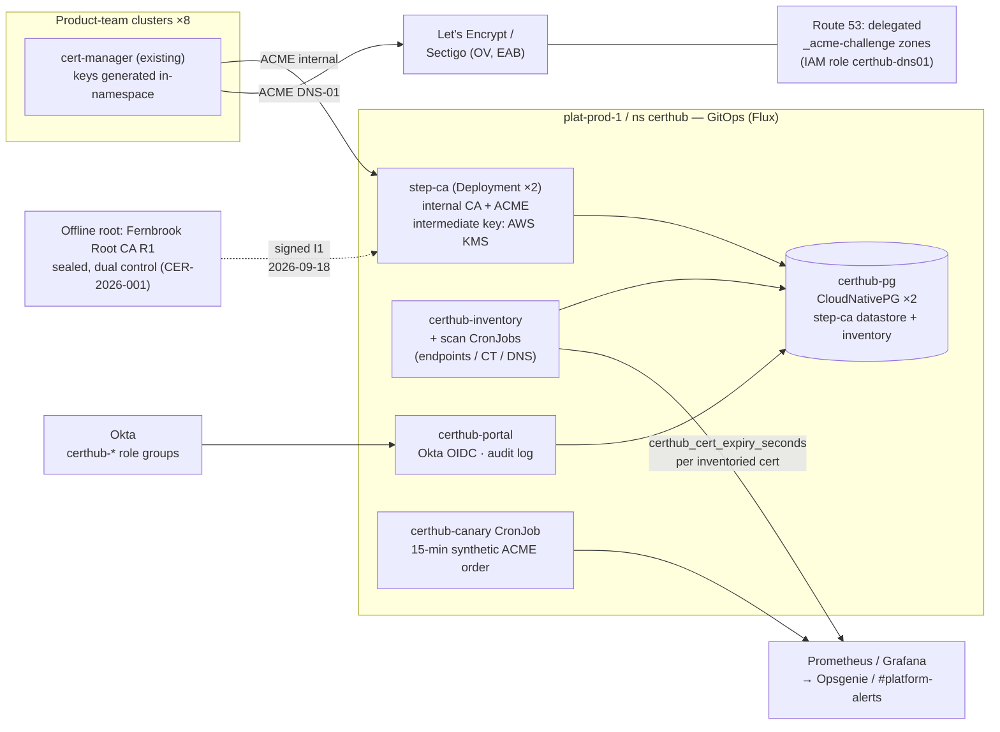

# CertHub — High-Level Design (as built)

**Fernbrook Software — internal.** Confluence `PLAT` → Service Docs → CertHub. Linked from the Platform Service Register entry (CertHub, Tier 1).

| | |
|---|---|
| **Status** | As built — current at Service Acceptance |
| **Author / owner** | Priya Chandra (Service Owner) |
| **Deputy** | Jordan Blake |
| **Reviewed by** | Elena Vasquez (pre-acceptance architecture review, 2026-11-14) |
| **Date** | 2026-11-19 |
| **Review cycle** | Proposed: annually alongside the June service-register review. *No standing review cycle exists for service docs (the PLAT document register covers governing documents only) — MSO to confirm.* |
| **Related** | Gate 2 record S3-FRM-02 (design of record); [Runbook](S4-runbook.md) · [Recovery procedure](S4-recovery-procedure.md) · [User guide](S4-user-guide.md) · [Monitoring & incident profile](S4-monitoring-incident-profile.md) |

## 1. Purpose and scope

CertHub is Fernbrook's certificate management service: it issues and auto-renews public TLS certificates, runs the internal CA for service-to-service certificates, and keeps the estate-wide certificate inventory with expiry monitoring. It exists because of INC-4211 (checkout API cert expiry, 4-hour customer-facing outage) and closes risk RSK-021.

In scope: public TLS via ACME (Let's Encrypt; Sectigo for OV/EV), internal mTLS certificates, inventory and expiry alerting for **every** certificate in the estate whether CertHub issued it or not. Out of scope (Gate 1 §1): code signing, certs on customer-managed domains, general secrets management.

## 2. Service overview

| Fact | Value |
|---|---|
| Tier | 1 (SAC baseline — product teams depend on it to ship) |
| Users | All eight product teams (deploy pipelines), Platform team, service desk |
| Portal | `https://certhub.internal.fernbrook.io` (API at `/api/v1`) |
| Internal ACME | `https://ca.internal.fernbrook.io/acme/internal/directory` |
| Runs on | Platform k8s cluster `plat-prod-1`, namespace `certhub` (dev twin on `plat-dev-1`) |
| Deployed via | Flux GitOps — repo `fernbrook/platform-certhub`, path `clusters/plat-prod-1/certhub/` |
| Availability target | 99.5% monthly, 24×7, measured on issuance (canary) + portal |
| On-call | Opsgenie Platform rota (Sev1/2); `#platform-alerts` (Sev3/4) |

**Failure mode is graceful by design:** a CertHub outage blocks *new* issuance and renewal only. Issued certs keep working; renewals start ≥30 days (public) / 8 hours (internal 24 h leafs) before expiry, so an outage inside RTO cannot itself cause an expiry.

## 3. Architecture as built

### Components

| Component | What it is | Where |
|---|---|---|
| `step-ca` | smallstep step-ca v0.28.x — internal CA + ACME server. Signs with the **Fernbrook Issuing CA I1** key held in AWS KMS (`alias/certhub-issuing-i1`, non-exportable, eu-west-2, Platform account). Config in Git (`ca.json`); datastore in `certhub-pg`. | Deployment `step-ca`, 2 replicas |
| `certhub-pg` | CloudNativePG cluster, 2 instances. Holds the step-ca datastore and the inventory DB (`inventory`). WAL + base backups to S3 via barman-cloud (see Recovery). | CNPG cluster `certhub-pg` |
| `certhub-inventory` | Inventory API + scanner. CronJobs: `inventory-scan-endpoints` (6-hourly — cluster Ingresses/Services + known VIP ranges :443), `inventory-scan-ct` (hourly CT-log watch for our domains), `inventory-scan-dns` (daily Route 53 zone walk). Dedupes by SPKI fingerprint (DEC11). **Metadata only — never private keys** (DEC4). | Deployment + 3 CronJobs |
| `certhub-portal` | Thin Go portal/API: onboarding, request status, posture dashboard, attribution + 12-month audit log. No issuance logic (DEC6). Okta OIDC, role groups. | Deployment `certhub-portal`, 2 replicas |
| `certhub-canary` | Synthetic ACME order for `canary.certhub.internal.fernbrook.io` every 15 min — the availability measurement for "issuance works end to end". | CronJob |
| cert-manager | *Product teams' existing* cert-manager instances do all actual issuance via `ClusterIssuer`s (§6). Not run by CertHub. | Each team cluster |
| trust distribution | `trust-manager` syncs bundle `fernbrook-ca-bundle` (Root R1 + Issuing I1) to all namespaces on all clusters. | Platform clusters |

## 4. Data and classification

| Data | Classification | Where | Notes |
|---|---|---|---|
| Intermediate CA key (Issuing I1) | **Restricted** | AWS KMS, non-exportable | The only Restricted item. Ratified at Gate 2 §8. |
| Root CA key (Root R1) | **Restricted** | Offline — two sealed encrypted USB tokens (TE-0041 office safe, TE-0042 off-site), dual control | Outside Velero/SEC-03 by ratified design exception. See Recovery §3. |
| Inventory (cert metadata, owners, expiry) | Internal | `certhub-pg` | Never private keys; leaf keys are generated in consuming namespaces and never transit CertHub. |
| Audit log (who issued what) | Internal | `certhub-pg`, 12-month retention | Requirement 5. |

## 5. Trust chain and key handling

- **Fernbrook Root CA R1** — 10-year, expires 2036-09-18. Generated at the witnessed ceremony 2026-09-18 (record **CER-2026-001**, Confluence PLAT → Service Docs → CertHub → Ceremonies; witnesses Elena Vasquez, Marcus Webb). Offline ever since. Used only to sign intermediates.
- **Fernbrook Issuing CA I1** — 3-year, expires 2029-09-18. Private key generated *in* KMS, non-exportable; step-ca signs via the KMS API. Compromise of the running service can never forfeit the root (DEC3).
- **Internal leaf certs** — 24-hour lifetime, renewed by cert-manager at 16 h (`renewBefore: 8h`). Revocation blast radius is bounded by rotation (DEC12).
- **Public certs** — Let's Encrypt 90-day (renew at 30 d); Sectigo OV 1-year via ACME EAB; EV portal-mediated (DEC10).
- **Intermediate renewal:** the I1 *certificate* is re-signed from the root at year 2 (2028-09) — a ceremony per the Recovery procedure §3.3. The KMS key itself does not rotate unless compromised.

## 6. Integration surfaces

| Surface | As built |
|---|---|
| **ClusterIssuers** | `certhub-internal` (ACME → step-ca, HTTP-01 in-cluster), `letsencrypt-prod` (ACME DNS-01), `sectigo-ov` (ACME EAB, DNS-01). One pattern for everything (DEC1/DEC2). Team integration = one `issuerRef` in config they already run. |
| **DNS** | `_acme-challenge.<zone>` NS-delegated to dedicated Route 53 hosted zones in the Platform account. Solver role `certhub-dns01` can write **only** challenge records in those zones — never production DNS (DEC5). `fernbrook-analytics.com` authoritative DNS moved to Route 53 to make this possible (DEC8, CHG-2258). |
| **Okta** | Portal SSO. Groups: `certhub-admin` (Platform team), `certhub-team-<team>` ×8 mapped to that team's namespaces/zones — a team can request certs only for what it owns. |
| **Service desk** | JSM request types *CertHub — Domain/namespace onboarding* and *CertHub — Certificate issue or failure*; Rafi's triage guide maps portal error states to runbook steps. |
| **Monitoring** | `certhub_cert_expiry_seconds{cn, owner_team, source, auto_renew}` per inventoried cert + golden signals. Full catalogue in [Monitoring & incident profile](S4-monitoring-incident-profile.md). |
| **Change** | Deploys/config via Flux under CH-01. Machine-driven issuance/renewal runs under pre-approved standard change class **SC-CERT-01** (CAB, 2026-09-16). Everything else is a normal change. |

## 7. Availability, capacity, DR

- Measured availability since go-live (2026-10-16): Oct 99.9% (partial month), Nov-to-date 100%. Target 99.5% monthly.
- Footprint ~0.6 vCPU / 1.4 GiB across the namespace; issuance volume ~340 orders/day (dominated by 24 h internal leafs). Headroom is not a concern at ×10.
- DR: rebuild from Git (Flux) + restore per the [Recovery procedure](S4-recovery-procedure.md). RTO 4 working hours / RPO 24 h — proven 2026-11-10 (RTL-2026-014, elapsed 2 h 50 m). Both sit comfortably inside every renewal window, so DR never races an expiry.

## 8. Estate inventory — as-built reality

First full estate scan completed 2026-10-17: **212 certificates** found (endpoints + CT + DNS walk), of which **31 were unknown to any team**. Ownership drive (Marcus, with team leads): 27 of 31 assigned by 2026-11-18; 4 remain unowned (all expiring >90 days out, alerting to `#platform-alerts`, target 2026-12-04 — tracked on FRM-03 §2). The orphaned wildcards `*.fernbrook-analytics.com` and `*.internal.fernbrook.io` were adopted and reissued through CertHub on 2026-10-28, a month ahead of the 2026-11-30 expiry.

Migration state at acceptance: 2 pilot teams live (legacy automation decommissioned — CHG-2231, CHG-2232); 6 teams scheduled to 2026-12-18 (Marcus owns the schedule; reported at monthly ops review per Gate 2 condition 5).

## 9. Design decisions and rationale (standing — per DEC7)

*Carried from the Gate 2 RAIDD and the PoC, plus build-time decisions. This section outlives the project: change it only with a recorded reason. The RAIDD itself closed with delivery.*

| # | Decision | Rationale | Evidence / date |
|---|---|---|---|
| DEC1 | **step-ca over Vault PKI** | ACME-native → one cert-manager `ClusterIssuer` pattern for internal *and* public issuance across all eight pipelines. Vault needed a second issuer type + per-namespace auth plumbing, restarted **sealed** in the PoC (standing ops burden a 5-person team shouldn't carry for PKI alone), and its BUSL licence needs legal re-review per version. | PoC scorecard 19/24 vs 13/24 (child page of Gate 1 record); 2026-09-01 |
| DEC2 | **All issuance via cert-manager ACME, never step-ca proprietary APIs** | One integration pattern; the CA stays swappable (exit path: standard X.509 + ACME throughout — we rent the CA, we don't marry it). | Gate 2 §6; Gate 1 §6a |
| DEC3 | **Two-level CA: offline root (10 y, sealed, dual control) → KMS-held non-exportable intermediate (3 y)** | Compromise of the running service can never forfeit the root. Ceremony SOP exists (Recovery §3.3). | Gate 2 §3; CER-2026-001 |
| DEC4 | **Inventory stores metadata only, never private keys** | Bounds the largest dataset to *Internal*; sole *Restricted* item is the KMS key. | Gate 2 §6 |
| DEC5 | **ACME DNS-01 via delegated `_acme-challenge` zones only** | Solver credentials write challenge records only; can never touch production DNS. | Gate 2 §6; PoC |
| DEC6 | **Thin portal in front of step-ca, not direct exposure** | Okta SSO, attribution, audit without forking CA behaviour; bespoke surface stays small enough to own (R6). | Gate 2 §6 |
| DEC7 | **This decision log lives in the HLD, standing** | The RAIDD closes with delivery; the *why* must outlive the project or CertHub's inheritor re-litigates Vault from scratch. Condition of Gate 2 approval. | Gate 2 §8 |
| DEC8 | **`fernbrook-analytics.com` authoritative DNS moved to Route 53** | The registrar's DNS could not create NS delegations for underscore-prefixed labels (`_acme-challenge`) — its panel and API both silently dropped them; support confirmed unsupported. Moving the zone (CHG-2258) beat per-cert CNAME workarounds for consistency with `fernbrook.io` (already Route 53). Cost of learning this: the inventory milestone slipped a week (2026-10-09 → 2026-10-16). | CHG-2258; 2026-10-13 |
| DEC9 | **CNPG barman-cloud S3 backups are authoritative for Postgres; Velero covers manifests/PVs only** | The first test restore (2026-11-04) **failed**: Velero's PV snapshot of a running Postgres restored inconsistent (step-ca datastore missing recent writes). Database-aware backup fixed it; re-test passed 2026-11-10. | RTL-2026-014; 2026-11-06 |
| DEC10 | **Sectigo OV via ACME EAB through the standard issuer; EV stays portal-mediated manual** | OV automates cleanly; EV requires vendor-side validation steps ACME can't drive, and our EV volume is one cert (checkout). Not worth automating (Principle: every artefact earns its place). | FIN-03 PO-2026-0412; 2026-09-25 |
| DEC11 | **Scanner dedupes by SPKI fingerprint; expected-but-unmanaged endpoints suppressed via `expected-certs.yaml` in Git, not DB edits** | First scans double-counted SNI variants and flagged appliance self-signed certs. Suppression in Git is reviewed, attributable and survives a DB restore. | 2026-10-20 |
| DEC12 | **Internal leaf lifetime 24 h, renew at 16 h** | Confirmed after two weeks of pilot: no operational friction, and revocation blast radius stays ≤24 h. | Pilot review 2026-10-30 |

## 10. Standing risks (transferred at acceptance)

R1 smallstep vendor health → **RSK-031**; R2 migration drag / split-brain estate → **RSK-032**; R6 bespoke portal ownership → **RSK-033**. All in the Platform Risk Register with named owners and review dates (Gate 2 condition 4). Smallstep supplier entry SUP-041 carries the exit path and June review date.
